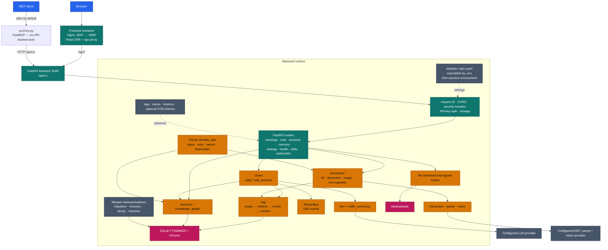
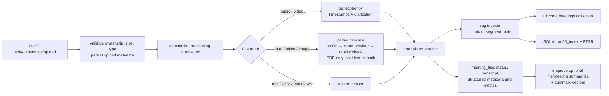
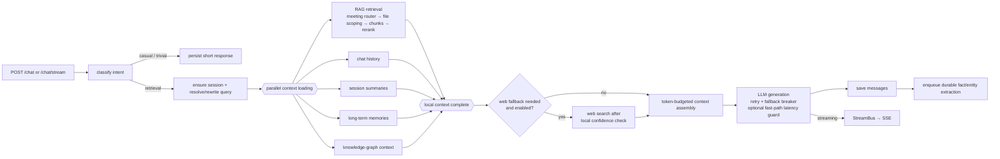

# Meeting Agent — System Architecture

The diagram below is the implementation-level system map. It reflects the
current router registry, service packages, storage layout, container ports, and
optional provider integrations. The editable Mermaid source is
[`architecture.mmd`](./architecture.mmd).

**Verified against implementation:** 2026-09-09.

## Runtime boundaries

| Boundary | Implementation contract |
|---|---|
| Browser → frontend | The production frontend serves the SPA on container port `8080` and proxies `/api/` to the backend; Compose publishes it on host port `8307`. Development Vite also serves on host port `8307` and proxies to `localhost:7008`. |
| Frontend → backend | REST and SSE use `/api/v1`; the browser WebSocket uses `/api/v1/ws`. The frontend injects the configured backend API key through the Nginx template; short-lived file and WebSocket tokens are separate mechanisms. |
| MCP → HTTP API | `backend/src/mcp.py` is a thin FastMCP adapter. The default transport is trusted stdio; HTTP/SSE is loopback-only and requires a downstream API key. Its six tools call the canonical HTTP API rather than importing domain or persistence services. The MCP listener itself has no inbound authentication and must not be published directly. |
| Backend → storage | SQLite at `data/meetings.db` is authoritative for relational state and FTS5/BM25 metadata. Chroma at `data/vectordb` stores semantic collections. Original files and derived assets remain under `data/uploads`. |
| Backend → providers | LLM, embeddings, document parsing, vision, and web search are selected through configuration bindings; ASR currently supports AssemblyAI only. Most provider concurrency and circuit-breaking state is process-local. |
| Request → durable work | Upload processing, file/meeting summaries, speaker rename/re-index, and fact extraction are committed to `durable_jobs` before the producer returns. Embedded workers claim leases inside the single backend process. Vector-generation rebuilds use a separate guarded maintenance task and are not durable jobs. |

## Request and data flows

### Ingestion

The processor is implemented in `backend/src/services/processor/` and dispatches
to `_processors/av.py`, `document.py`, `image.py`, and `text.py`. Indexing has
separate entry points for plain text, structured pages, and timestamped
segments; the configured non-text chunking strategy determines which route is
used for audio, video, and image artefacts.

### Answer generation

The synchronous and streaming paths share the same `PipelineContext` and
retrieval/context stages. Streaming additionally emits ordered `step`,
`token`, `sources`, `web_results`, `trace`, `heartbeat`, and terminal
`done`/`error` events through `backend/src/services/stream_bus.py`.
When the opt-in fast-path latency guard expires, generation returns a labelled,
source-backed extractive fallback (or an explicit timeout message) instead of
presenting an unfinished model response as complete.

## Operational architecture

The FastAPI lifespan performs the Alembic upgrade and fail-closed local/security
checks, then pre-warms provider capabilities and starts recovery and maintenance
loops. Provider pre-warm failures are reported as degraded capabilities rather
than being treated as proof that every route is unavailable. Recovery includes
durable-job lease handling, stale meeting and summary recovery, BM25 drift
checks, vector reconciliation, memory decay, retention cleanup, and WAL
checkpointing. The application rejects multiple production backend workers
because SQLite, local files, token buckets, most circuit breakers, and several
coordination caches are not distributed across processes.

For deployment and failure handling, see [`deployment-and-operations.md`](./deployment-and-operations.md),
[`../operations-guide.md`](../operations-guide.md), and
[`../adr/ADR-006-single-instance-deployment.md`](../adr/ADR-006-single-instance-deployment.md).
