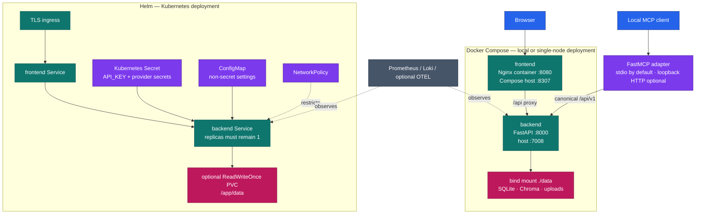
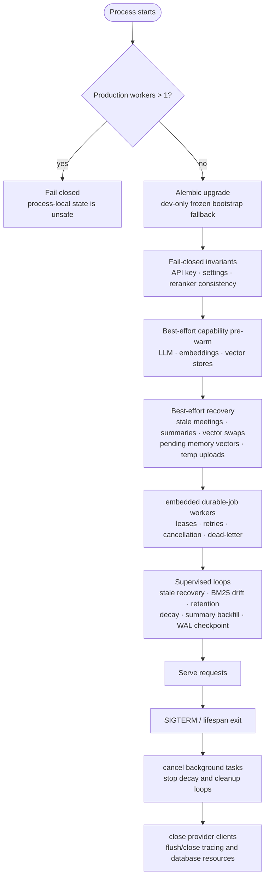
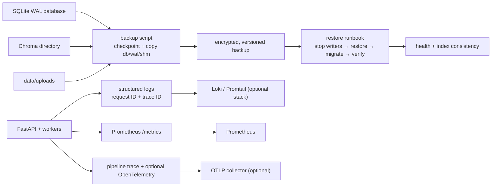

# Deployment and Operations Architecture

This diagram describes the supported deployment boundary and the lifecycle
paths that keep SQLite, Chroma, uploaded assets, and background tasks
consistent. It intentionally distinguishes the local Docker Compose topology
from the single-backend-replica Helm topology.

**Verified against implementation:** 2026-09-10.

## Deployment topology

### Deployment invariants

- Docker Compose exposes the backend on `127.0.0.1:7008` and publishes the
  frontend's Nginx port `8080` on host port `8307`. The proxy path is
  `/api/` → `backend:8000`.
- The Helm chart rejects `backend.replicaCount > 1` and does not expose an HPA.
  The restriction is intentional: SQLite WAL state, local uploads, Chroma
  persistence, token buckets, circuit breakers, and extraction deduplication
  are not distributed.
- A persistent volume is required if data must survive pod replacement. The
  chart uses `ReadWriteOnce`, so it does not turn the backend into a scalable
  shared-storage service.
- Backend secrets come from a Kubernetes Secret; ordinary settings come from a
  ConfigMap. Production ingress requires TLS unless explicitly disabled for a
  local test behind another terminating proxy.

## Startup and shutdown lifecycle

Critical startup failures stop non-development deployments; development may
enter degraded mode for diagnosis. Capability pre-warm and best-effort tasks
record failures without preventing the process from serving. Deployment health probes should
use `/api/v1/health/live` for liveness and `/api/v1/health/ready` for readiness.

## Backup, recovery, and observability

Backups must include the SQLite database state, the Chroma persistence tree,
and uploaded/derived assets when citations or file previews must remain
recoverable. Restoring only SQLite or only Chroma creates an index/data
mismatch. The detailed procedures are in
[`backend/docs/operations/backup.md`](../../backend/docs/operations/backup.md)
and [`backend/docs/operations/restore.md`](../../backend/docs/operations/restore.md).
