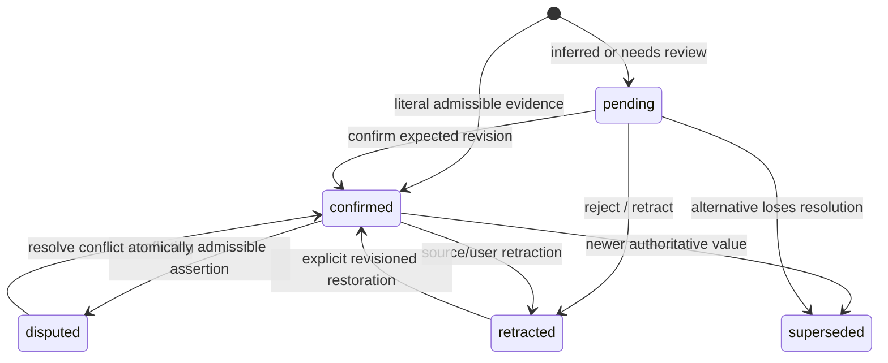
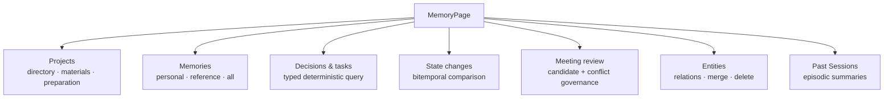

# Memory and Knowledge-Graph Architecture

**Verified against implementation:** 2026-09-09.

Memory is a governed data subsystem, not an unqualified vector cache. SQLite
is authoritative for identity, revisions, evidence, lifecycle, business time,
system knowledge time, projects, sessions, and the entity graph. Chroma stores
rebuildable semantic indexes. Only facts that pass both lifecycle and evidence
admission can enter answer context.

## System map

```mermaid
flowchart LR
    Chat["Persisted chat turn"] --> Enqueue["enqueue fact_extraction"]
    Source["Ready meeting material<br/>bounded evidence windows"] --> Enqueue
    Enqueue --> Jobs["SQLite durable_jobs<br/>dedupe · lease · retry · dead-letter"]
    Jobs --> Extract["facts + entities extraction<br/>one combined call or separate calls"]
    Extract --> Validate["evidence admission<br/>quote · polarity · direction · scope<br/>source revision fence"]

    Validate --> Ledger["SQLite fact ledger<br/>user_memories + memory_fact_versions<br/>scopes · evidence · audit"]
    Validate --> Graph["SQLite entity graph<br/>memory_entities + memory_relations"]
    Ledger --> Outbox["vector state / deletion outbox"]
    Graph --> EntityIndex["Chroma memory_entities"]
    Outbox --> FactIndex["Chroma user_memories"]

    Sessions["chat_messages + session_summaries"] --> SessionIndex["Chroma session_summaries"]
    Ledger --> Recall["current typed recall<br/>or bitemporal SQL snapshot"]
    FactIndex --> Recall
    Graph --> Recall
    EntityIndex --> Recall
    Sessions --> Recall
    SessionIndex --> Recall
    Recall --> Context["PipelineContext → token-budgeted prompt"]

    UI["/memory workspace"] --> Ledger
    UI --> Graph
    UI --> Sessions

    classDef input fill:#2563eb,stroke:#1e3a8a,color:#fff
    classDef process fill:#d97706,stroke:#92400e,color:#111
    classDef store fill:#be185d,stroke:#831843,color:#fff
    classDef output fill:#0f766e,stroke:#115e59,color:#fff
    class Chat,Source,UI input
    class Enqueue,Extract,Validate,Recall,Outbox process
    class Jobs,Ledger,Graph,FactIndex,EntityIndex,Sessions,SessionIndex store
    class Context output
```



### Trust and consistency boundaries

- The API credential determines the principal; meeting, file, project, and
  memory-library scope further restrict retrieval but never replace ownership.
- Automatic extraction uses user text or persisted source excerpts as
  evidence. The assistant's generated answer is not accepted as its own source.
- File-derived jobs carry source revision, content hash, coordinates, and event
  time. A deleted or replaced source invalidates the job before publication.
- Current semantic indexes contain active, confirmed facts. Candidate results
  are validated against SQLite again before prompt injection.
- Typed lists and historical queries use SQLite. Semantic top-k is not used to
  claim an exhaustive decision or action-item list.

## Fact lifecycle and time model



Each logical key has an append-only `memory_fact_versions` history. Two time
axes have different meanings:

| Coordinate | Fields | Meaning |
|---|---|---|
| Business validity | `valid_from`, `valid_to` | when the assertion is true in the represented world |
| System knowledge | `recorded_at`, `recorded_to` | when this system knew that revision |

`valid_at` and `known_at` queries select one coherent historical snapshot.
Current-only profiles, entity projections, session summaries, web search, and
current semantic recall are omitted when they cannot honor that same time
boundary.

## Recall, decay, and deletion

Current semantic recall combines five normalized signals. Defaults come from
`backend/src/core/config.py` and are normalized again at runtime:

```text
score = 0.35 × semantic_similarity
      + 0.15 × freshness
      + 0.25 × salience
      + 0.15 × confidence
      + 0.10 × usefulness
```

Freshness decays exponentially from the last confirmation/access reference:

```text
freshness(t) = freshness(0) × exp(-MEMORY_DECAY_RATE_PER_DAY × days_elapsed)
```

The lifecycle distinguishes three operations that must not be conflated:

| Operation | SQL fact/version ledger | Semantic vector |
|---|---|---|
| Capacity or low-value stale recall | set `archived_at`; retain business/history data | remove from active index through durable cleanup |
| TTL expiry | delete the expired current memory row | immediate best effort plus `pending_vector_deletions` retry/dead-letter |
| Explicit memory/account deletion | privacy-oriented hard deletion according to the API workflow | tracked cleanup, including batch status for account erasure |

Recall activity changes access metadata, not truth status or usefulness.
Usefulness changes only through explicit feedback.

## Memory workspace



The desktop page uses tabs; narrow screens use an equivalent selector. URL
query parameters preserve the active view and project context. The Memories
view keeps its library selector and virtualized list in one bounded flex
column: filters/actions stay above the independent record scroll region, and
long evidence cannot overflow the page card.

Meeting Review uses stable snapshot paging and expected revisions. Source
links open the underlying meeting/material evidence; confirming, retracting,
editing, or resolving a conflict changes the backend fact ledger, not only the
visual badge.

## Implementation map

| Concern | Implementation |
|---|---|
| UI composition | `frontend/src/pages/MemoryPage.tsx`, `frontend/src/components/memory/` |
| UI data/actions | `frontend/src/hooks/useMemoryActions.ts`, `frontend/src/api/client-memory.ts` |
| REST contract | `backend/src/api/routers/memory.py`, `backend/src/models/schemas/memory.py` |
| Chat context loading | `backend/src/services/chain/_steps_context.py` |
| Durable extraction | `backend/src/services/chain/_steps_generate.py`, `_extraction.py`, `backend/src/services/jobs.py` |
| Fact CRUD/search/lifecycle | `backend/src/services/memory/_service/` |
| Evidence admission | `backend/src/services/memory/evidence_admission.py` |
| Session history/summaries | `backend/src/services/memory/_history.py`, `_summary_service.py`, `_summary_vectorstore.py` |
| Entity graph | `backend/src/services/knowledge_graph/` |
| Structured persistence | `backend/src/core/database/memories.py`, `knowledge_graph.py`, `memory_lifecycle.py` |
| Semantic indexes | `backend/src/services/memory/_vectorstore.py`, `_summary_vectorstore.py`, `backend/src/services/knowledge_graph/_vectorstore.py` |

For detailed invariants and API behavior, see
[`../../backend/docs/memory-and-kg.md`](../../backend/docs/memory-and-kg.md) and
[`../../backend/docs/api-reference.md`](../../backend/docs/api-reference.md).
