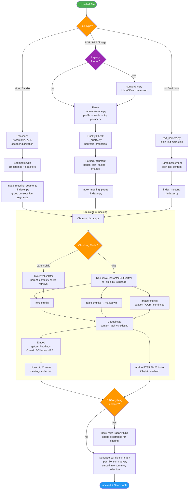
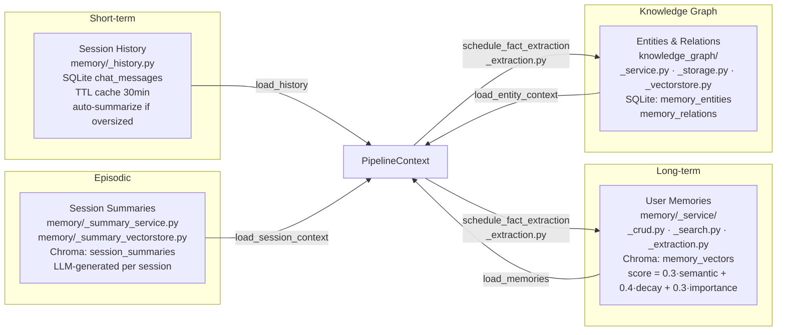

# RAG Pipeline Architecture

## Query Path

```mermaid
flowchart TD
    Start([POST /api/v1/chat or /chat/stream]) --> Req[ChatRequest<br/>question · session_id · meeting_ids<br/>top_k · rag_mode · use_web_search]
    Req --> Ask[ask / ask_stream<br/>chain/_api.py]
    Ask --> Ctx[Create PipelineContext<br/>chain/_context.py]
    Ctx --> Classify{_classify_intent<br/>_routing.py}

    Classify -->|greeting / smalltalk| Casual[_casual_response]
    Casual --> Save1[save_messages]
    Save1 --> Ret1([Return PipelineResult])

    Classify -->|question / retrieval| Skill{Skill Matching<br/>_skill_matching.py}
    Skill -->|matched| SkillDef[Load Skill Definition + Prompt]
    Skill -->|no match| Session

    SkillDef --> Session

    subgraph Session Setup
        Session[ensure_session<br/>_steps_session.py<br/>create/validate in SQLite]
    end

    Session --> Rewrite[rewrite_query_step<br/>_resolver.py (multi-turn)<br/>_query.py (single-turn)<br/>+ adaptive top_k]

    Rewrite --> Prewarm[_prewarm_query_embedding<br/>populate LRU cache for<br/>parallel branches]

    Prewarm --> Parallel{Parallel Branches}

    subgraph Retrieval Branch
        direction TB
        P1[retrieve_documents<br/>_steps_retrieve.py]
        P1 --> Scope{file_ids<br/>specified?}

        Scope -->|no: Broad Recall| Broad[_retrieve_broad_recall<br/>_retrieve_broad.py]
        Scope -->|yes: Scoped| Scoped[_retrieve_scoped<br/>_retrieve_broad.py]

        Broad --> MRouter{Meeting Summary<br/>Router enabled?}
        MRouter -->|yes| MRoute[route_meetings_by_summary<br/>_meeting_summary_vectorstore.py]
        MRouter -->|no| FileScope
        MRoute --> FileScope

        FileScope[File Scoping Strategy<br/>_scoping_strategies.py]
        FileScope --> Funnel[Funnel: Summary Router +<br/>Wide Fetch → RRF Merge<br/>_summary_router.py + _funnel_narrow.py]
        Funnel --> Fair[fair_retrieve_per_file<br/>_fair_retriever.py<br/>per-file budget + concurrency]
        Fair --> Filters

        Scoped --> Retrieve
        Fair --> Retrieve

        Retrieve[retrieve<br/>_retriever.py]
        Retrieve --> Strategy{Select Strategy<br/>_strategies.py}

        Strategy -->|native| Vec[_vector_retrieve<br/>Chroma similarity search]
        Strategy -->|hybrid| Hybrid[_hybrid_retrieve<br/>Vector + BM25 → RRF merge]
        Strategy -->|multimodal| MM[_run_multimodal_strategy<br/>RAGAnything<br/>↓ fallback to native]
        Strategy -->|hybrid_multimodal| HMM[Native + RAGAnything<br/>RRF merge]

        Vec --> Filters
        Hybrid --> Filters
        MM --> Filters
        HMM --> Filters

        Filters[Post-Retrieval Filters<br/>_retrieve_filters.py<br/>speaker · temporal · content-type bias]
        Filters --> PreDedup[pre_rerank_dedup<br/>_retrieve_post.py]
        PreDedup --> Rerank

        Rerank[rerank_documents<br/>_retrieve_post.py<br/>Cohere / BGE CrossEncoder]
        Rerank --> Dedup[suppress_near_duplicates<br/>4-gram overlap ≥ 0.85 filtered]
        Dedup --> Docs[ctx.docs]
    end

    subgraph Context Branches
        direction TB
        P2[load_memories<br/>_steps_context.py<br/>MemoryService<br/>profile + semantic search]
        P3[load_session_context<br/>_steps_context.py<br/>SessionSummaryService<br/>search past session summaries]
        P4[load_entity_context<br/>_steps_context.py<br/>KnowledgeGraphService<br/>entity relationships]
        P5[perform_web_search<br/>_steps_context.py<br/>DuckDuckGo / SerpAPI / Tavily]
        P6[load_history<br/>_steps_context.py<br/>SQLiteChatMessageHistory<br/>summarize if oversized]
    end

    Parallel --> P1
    Parallel --> P2
    Parallel --> P3
    Parallel --> P4
    Parallel --> P5
    Parallel --> P6

    Docs --> Build
    P2 --> Build
    P3 --> Build
    P4 --> Build
    P5 --> Build
    P6 --> Build

    subgraph Context Assembly & Generation
        Build[build_context<br/>_steps_generate.py]
        Build --> Truncate[Truncate each source to token budget]
        Truncate --> Format[_format_docs → numbered citations<br/>_build_system_context → tagged sections]
        Format --> Budget[Enforce total token budget<br/>drop lowest-ranked docs if over]
        Budget --> Combined[ctx.combined_context]

        Combined --> Generate[generate_answer<br/>LCEL: prompt → llm → StrOutputParser]
        Generate --> CacheCheck{Anthropic<br/>prompt caching?}
        CacheCheck -->|yes| Cached[Apply cache_control<br/>to system message<br/>_anthropic_cache.py]
        CacheCheck -->|no| MMCheck
        Cached --> MMCheck
        MMCheck{Docs contain<br/>images?}
        MMCheck -->|yes| B64[Inject base64 images<br/>into HumanMessage]
        MMCheck -->|no| Invoke
        B64 --> Invoke[_invoke_chain_with_retry<br/>_generate_helpers.py<br/>traffic controller + circuit breaker]
        Invoke --> Strip[Strip thinking blocks<br/>→ ctx.answer]
    end

    Strip --> Save2[save_messages<br/>HumanMessage + AIMessage<br/>→ SQLite chat_messages]
    Save2 --> Extract[schedule_fact_extraction<br/>_extraction.py<br/>fire-and-forget background]

    Extract --> ComboCheck{Combined<br/>extraction?}
    ComboCheck -->|yes| ComboExtract[combined_extract<br/>single LLM call: facts + entities]
    ComboCheck -->|no| SepExtract[separate calls]
    SepExtract --> FactExtract[memory_service.auto_extract_facts<br/>→ key-value memories]
    SepExtract --> EntityExtract[kg_service.extract_entities<br/>→ knowledge graph entities]
    ComboExtract --> Ret2
    FactExtract --> Ret2
    EntityExtract --> Ret2

    Ret2([Return PipelineResult<br/>answer · sources · session_id<br/>web_results · trace · skill_used])

    style Start fill:#4CAF50,color:#fff
    style Ret1 fill:#2196F3,color:#fff
    style Ret2 fill:#2196F3,color:#fff
    style Parallel fill:#FF9800,color:#fff
    style Strategy fill:#9C27B0,color:#fff
    style Classify fill:#FF9800,color:#fff
    style Skill fill:#FF9800,color:#fff
    style Scope fill:#9C27B0,color:#fff
    style CacheCheck fill:#FF9800,color:#fff
    style MMCheck fill:#FF9800,color:#fff
    style ComboCheck fill:#FF9800,color:#fff
```

## Indexing Path



## Memory Layer


