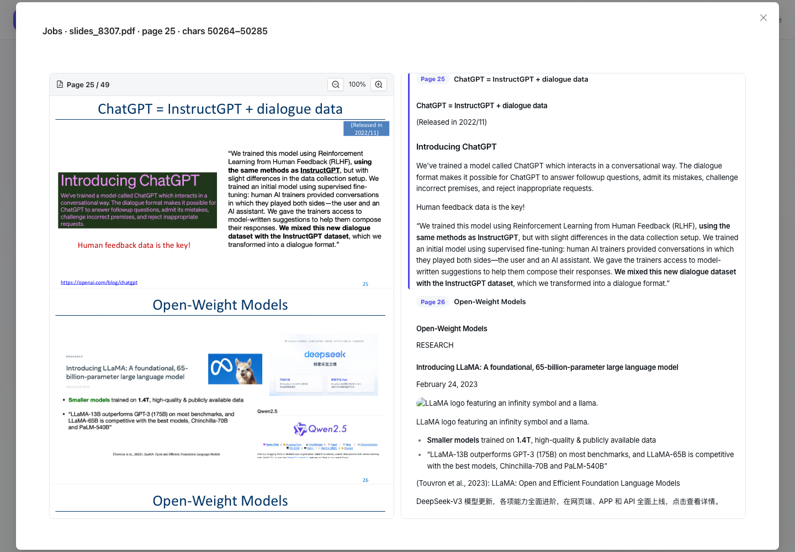

# 前端页面严格检查与优化方案（2026-09-06）

> 历史前端审计：保留当时复现、截图与验证，不代表当前页面仍存在或已消除同名问题。当前前端说明见 [frontend/docs/README.md](../README.md)。

当前前端已有统一配色、主题切换、主要功能和响应式导航，但尚不能判定为完成了精细的产品体验验收。真实数据下，来源定位、窄屏内容裁切、无障碍标签及颜色对比度仍有具体问题。自动化空数据检查通过，不能代表有数据的页面通过。

本轮已实施 Memory 来源定位修复；下面其余问题和视觉调整作为待实施方案。

后续用户反馈揭示了连续滚动和页内证据定位仍有遗漏；本报告的首次落点验证不等于双栏完整验收。补充根因、同步控制器替换及新增回归见[来源与 PDF 双栏同步补充修复](2026-09-06-pdf-sync-followup.md)。

## 检查范围与证据边界

- 运行目标：本地 `http://localhost:8307`，使用现有后端数据，读取六个主页面：Chat、Generate、Materials、History、Memory、Settings；补充检查 Memory 的 Entities、Past Sessions 和来源预览。
- 桌面视觉检查：1440 × 1000；布局测量扩展至 320、768、1440、1920px 宽度。手机主题检查：390 × 844，亮色与暗色。
- axe 扫描：六个主页面的桌面亮色状态、手机两种主题状态，以及 Entities、Past Sessions 桌面状态。检查 WCAG A/AA 相关规则，不将自动化结果解释为完整无障碍认证。
- 六个主页面在手机两种主题的初始加载中未捕获到未处理 JavaScript 异常。390px 下主滚动容器未出现横向溢出，但 Memory 行内正文和按钮仍重叠，说明单独测 `scrollWidth` 不足以验收布局。
- 本轮没有执行删除真实数据、重建索引、修改设置或收费模型调用；生成中的长内容、真实网络中断、屏幕阅读器实际操作、软键盘和所有模态框组合并未穷举。这里的结论是已检查场景中的问题清单，不宣称找到了所有可能缺陷。

## 已完成：Memory 来源精确定位

### 根因

1. `Open source material` 原先只携带 `meeting_ids[0]`、`file_ids[0]`，丢失 `evidence_refs` 中的版本、窗口、页码和时间；两个作用域数组并不保证位置对应。
2. 真实 PDF 记忆保存的通常是提取文本的 Unicode 字符区间，没有页码。旧预览链路只使用页码，默认回到第一页。
3. PDF 加载占位使用近似 A4 比例；实际来源是横向幻灯片。提前滚动后，前序页面高度改变，落点偏移；双栏观察器还会在程序滚动期间相互覆盖页码。
4. Materials 的旧来源去重只按会议/文件编号，无法正确处理同一路由上再次打开同一文件的其他位置；来源不存在时有路径直接静默返回。
5. 幻灯片预览没有消费传入的页码。

### 修复行为

- 主按钮与逐条证据链接共用来源参数构造，保存证据摘录、来源版本和位置；优先使用每条证据明确保存的会议/文件关系。
- 多个来源通过菜单分别选择；缺失明确会议且作用域不唯一时不猜测目标。旧记录只有唯一会议和文件时仍可打开。
- Materials 直接获取目标会议，不依赖列表是否包含它；可取消过时请求，报告来源删除或读取失败，并保留无关 URL 参数。
- 没有明确页码/时间时，用**该文件持久化的提取文本**核对窗口和摘录，再映射到 PDF/幻灯片页码或音视频片段起止时间。支持 Unicode code point 偏移及摘录换行；重复摘录无法唯一核实时不做模糊猜测。
- 来源版本不一致时拦截。精确位置无法核实时给出提示，再提供当前文件供人工查看，不把默认第一页声称为证据定位成功。
- PDF 在目标页及前序页完成布局后定位，仅滚动预览容器；程序定位期间抑制双栏观察器互相干扰。幻灯片消费目标页码，手机引用入口优先显示目标页内容。

### 实际验证

真实记录 `topic.chatgpt.release_date` 的来源为会议 `2`、文件 `10`（`slides_8307.pdf`）。原证据窗口是 `50011–54499`，核对摘录后得到 `50264–50285`，解析到 **第 25 页**。浏览器中原 PDF 与解析内容均落在第 25 页，可见 `(Released in 2022/11)`。这验证了落点，而不仅是 URL 或弹窗标题。



相关实现：

- [来源链接](../../src/components/memory/MemoryList.tsx)、[参数与目标校验](../../src/utils/evidenceNavigation.ts)
- [来源位置解析](../../src/utils/resolveEvidenceLocation.ts)、[Materials 来源请求流程](../../src/pages/MaterialsPage.tsx)
- [PDF 预览](../../src/components/materials/file-views/PdfSplitViewer.tsx)、[双栏滚动](../../src/components/materials/file-views/usePdfPageSync.ts)、[幻灯片预览](../../src/components/materials/file-views/SlidesViewer.tsx)

## 仍需修复的已确认问题

P1 表示阻碍阅读、操作或无障碍使用；P2 表示可用但存在明显体验缺陷。以下优先级是本轮工程判断。

| 优先级 | 问题与证据 | 修改方案 | 验收条件 |
| --- | --- | --- | --- |
| P1 | Memory 在 390px 下，行末 6–7 个按钮占据正文宽度；长 key 与图标重叠，正文被压成窄列。 | 将行改为响应式网格；手机正文独占一行，操作置于下方；保留来源与确认等主要动作，将历史、反馈、编辑等收进“更多”。长 key 使用 `overflow-wrap:anywhere`。 | 320/390/768px 下长 key、摘录、按钮均不重叠；键盘仍可访问所有动作。 |
| P1 | Generate 在 320px 下主容器 `scrollWidth=337`；网格声明 `minmax(320px, 1fr)`，外层还占水平内边距。 | 改为 `minmax(min(100%, 320px), 1fr)`，并为网格子项设置 `min-width:0`。 | 主容器不出现横向滚动，卡片与表单右边缘完整可见。 |
| P1 | Materials 在 320px 下卡片右侧被裁切；网格最小列宽 300px 加内部 padding，父容器 `overflow-x:hidden` 掩盖越界。 | 允许列宽缩小至可用宽度；统一外层和网格间距。不要以隐藏溢出作为修复。 | 卡片完整显示，右侧删除等控件位于可视区域，长标题不会推宽卡片。 |
| P1 | Memory 存在实际颜色对比度失败：1440px 亮色扫描出现 15 个失败节点；390px 亮色 4 个、暗色 2 个，主要是金色标签和来源链接。节点数随可见记录数变化。 | 使用按主题定义的语义颜色；调整普通文字链接、金色标签前景/背景；覆盖 hover、disabled、focus 状态。 | 用真实填充记录重新扫描；普通文本目标对比度至少 4.5:1；同时人工检查视觉层级。 |
| P1 | Entities 的类型筛选 Select 缺少可访问名称，axe 命中 `label`；折叠分类的部分彩色标签也命中对比度规则。 | 添加可见标签或正确关联的 `aria-label`；与 Memory 共用语义标签颜色。 | 筛选器可通过名称定位和读出；填充数据下 `label` 与对比度检查通过。 |
| P2 | Past Sessions 的 Continue 链接在桌面亮色扫描命中对比度规则。 | 与全局文字链接样式统一，使用更明确的“继续此会话”主操作。 | 亮暗主题可读，键盘焦点明显，跳转目标会话保持正确。 |
| P2 | PDF 解析内容中有破图；实测 `img.src="data:,"`。`resolveMarkdownImageSrc` 用这一值表示无法解析的图片，`PageLayoutView` 仍将其作为合法图片渲染。 | 对不可解析资源返回明确的空结果，显示轻量“图片不可用”占位或隐藏纯装饰图；保留有效资产 URL 的安全校验。 | 不出现浏览器破图图标；有效图片正常显示，失败资源有适当提示。 |
| P2 | Generate 未选会议时按钮虽然 disabled，仍使用强烈紫色渐变；文字变灰后既难读，又像可点击主按钮。 | 仅在可用时应用主色/渐变；disabled 使用独立中性样式，并在旁边说明“先选择会议”。 | 用户能立即区分可用与不可用状态；启用后视觉变化明确。此项为体验问题，不将 disabled 文本列为强制对比度违规。 |

截图证据：

- [Memory 手机正文与操作挤压](2026-09-06/memory-mobile.png)
- [Generate 320px 网格超宽](2026-09-06/generate-320.png)
- [Materials 320px 卡片裁切](2026-09-06/materials-320.png)

对应代码入口：[MemoryList](../../src/components/memory/MemoryList.tsx)、[全局样式](../../src/styles/index.css)、[GenerationPage](../../src/pages/GenerationPage.tsx)、[生成按钮](../../src/components/generation/GenerationConfigCard.tsx)、[材料网格](../../src/components/VirtualMeetingList.tsx)、[EntityGraph](../../src/components/memory/EntityGraph.tsx)、[Past Sessions](../../src/components/memory/SessionSummariesTab.tsx)、[图片处理](../../src/utils/markdown.ts)。

## 视觉和信息结构的优化建议

这些是基于当前页面的设计判断，不能与功能故障混为一谈。

| 页面/范围 | 当前体验 | 建议 |
| --- | --- | --- |
| 全局 | 页面内容宽度分别使用 1000、1200、1400、1600px，页首间距和卡片层级不统一。手机顶栏主要只有标志，当前位置需要从内容推断。 | 建立 `PageShell` 和 `PageHeader`：列表、工作区、表单三种布局预设，共用左右留白与纵向间距；手机明确显示页面名。按任务需要保留不同内容宽度。 |
| Memory 信息密度 | 内部 key、多个同级彩色标签、字符偏移和 revision 占据主要视线；事实内容不够突出；首屏看不到总数。 | 第一行突出事实内容与状态，第二行显示项目/来源/更新；key、revision、字符区间放进可展开详情；工具栏显示总数、已加载数和筛选条件。 |
| Memory 工具栏 | 添加、导入、导出、衰减、刷新视觉权重相同；生命周期占位被截断；普通输入筛选与语义搜索共用一个搜索框，差异不明显。 | 明确“添加记忆”主按钮；导入/导出归入工具菜单；衰减放维护操作；筛选使用可见短标签；为关键字/语义搜索显示模式和结果状态。 |
| Memory 来源展示 | 虽然本轮已修正点击行为，界面仍同时显示技术坐标链接与通用来源按钮。 | 整合为“文件名 · 第 N 页/时间段”的来源条目；多来源保留逐项选择，技术坐标在详情可复制。 |
| Chat | 空状态占据大量空间；未选择会议时仍有“Summarize this meeting”等快捷问题；手机仍显示桌面键盘说明并多次换行。 | 引导明确呈现“选择材料 → 提问”；快捷问题根据上下文状态启用或解释；手机隐藏 Enter/Shift+Enter 快捷键说明，并验证软键盘下输入框可见。 |
| Generate | 首次进入就展示大量技能单选项；输出空卡片固定最小 400px，手机需要额外滚动经过空白；生成入口与输出区域的关系较弱。 | 分常用/全部技能，显示简短用途；空状态给出输出预览或下一步；有结果后展开阅读区，手机生成完成后提供跳转到结果。 |
| Materials | 卡片主要是标题、日期、状态，大面积空白，但常用的文件数量、类型组成、更新时间不明显。 | 增加紧凑的信息摘要，使用一致的卡片高度和状态区域；把删除放次级菜单，将打开资料作为唯一明显主动作。 |
| History / Past Sessions | 两处都可继续会话，但结构、元信息、摘要密度不一致；Past Sessions 长摘要一行跨度过大。 | 共用会话摘要行组件，限制摘要阅读宽度，统一时间与标题层级；清晰标注“会话记录”和“已提取摘要”的关系。 |
| Settings | 顶部保存按钮会随长表单滚出视野；手机持久化说明占据较大首屏空间。 | 在编辑后显示吸底保存条及修改数量；保留持久化语义但采用简短摘要和展开说明；为高级设置提供局部搜索。 |
| 设计系统 | 大圆角、阴影、淡色底和多种标签叠加，正文与辅助信息区分不够稳定；样式存在大量全局 `!important`。 | 统一语义颜色、边界、字号和间距令牌，减少对第三方组件全局强覆盖；优先用排版和位置表达层级，再用颜色表达状态。 |

## 建议实施顺序

1. **可读可用修复**：窄屏网格、Memory 操作布局、真实数据对比度、Entities 标签、破图占位、禁用按钮状态。验收以真实数据和长内容为主。
2. **Memory 体验重构**：事实内容优先、来源可读名称、筛选与搜索模式、总数和加载状态、低频操作收纳。复用本轮已打通的来源定位链路。
3. **全局视觉一致性**：PageShell/PageHeader、会话行、空状态、手机导航位置、Settings 保存条及设计令牌。
4. **体验回归门禁**：320/390/768/1440/1920px；真实填充/空/错误/加载状态；亮暗主题；键盘和放大字体；长标题、多来源、多页 PDF 与历史会话继续。检查控件边界和落点，不能只检查无横向滚动、弹窗出现或标题页码。

大型 PDF 后续应采用可见页渲染与缓存准确页高；首次修复中的“等待前序页面布局稳定”已在补充修复中被持续维护阅读位置的控制器替换，大文件的完整渲染仍有成本。定位请求目前会读取会议的逐文件文本，后续可以提供按文件的版本化证据定位 API，减少读取体积。这两项为性能优化方向，本轮没有声称解决。

## 本轮验证结果

- 前端单元测试：32 个文件、168 个测试通过。
- 新增来源浏览器回归：5/5 通过（Chromium，模拟 API；PDF fixture 在内存中生成）。覆盖主按钮、同路由重开不同位置、旧版本、删除来源及 PDF 布局完成后的实际落点。
- 真实本地后端：Memory → `slides_8307.pdf` 第 25 页，原文/解析双栏落点检查通过。
- 补充实测：390px 手机宽度下同一条记录仍落在第 25 页；另一条 `topic.gpt2.release_date` 在桌面端落到第 6 页，摘录区间为 `6309–6355`。
- TypeScript/生产构建、Bundle budget、ESLint、修改文件格式和 `git diff --check` 通过。
- 视觉审计发现的其余缺陷仍然待实施，不能把上述工程测试通过解释为这些缺陷已经修复。

复现新增浏览器回归：

```sh
cd frontend
PLAYWRIGHT_SKIP_WEBSERVER=1 PLAYWRIGHT_BASE_URL=http://localhost:8307 \
  npx playwright test e2e/source-navigation.spec.ts --project=chromium --workers=1
```

单元回归：[位置解析](../../src/utils/resolveEvidenceLocation.test.ts)、[Memory 操作](../../src/components/memory/MemoryList.test.tsx)；浏览器回归：[source-navigation.spec.ts](../../e2e/source-navigation.spec.ts)。
